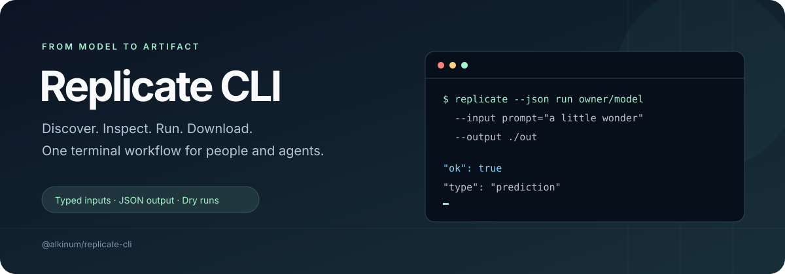

<p align="center">
  
</p>

<p align="center">
  <a href="https://nodejs.org/"></a>
  <a href="https://pnpm.io/"></a>
  <a href="https://www.typescriptlang.org/"></a>
  <a href="LICENSE"></a>
</p>

<p align="center">
  A terminal toolkit for the <a href="https://replicate.com">Replicate API</a>.<br />
  Find a model, inspect its inputs, run a prediction, and save the results — with structured output at every step.
</p>

<p align="center">
  <a href="#quick-start">Quick start</a> ·
  <a href="#inputs-and-files">Inputs &amp; files</a> ·
  <a href="#commands">Commands</a> ·
  <a href="#automation">Automation</a> ·
  <a href="#development">Development</a>
</p>

## What you can do

| Workflow | Included |
| --- | --- |
| Discover | Search models, browse collections, inspect versions and input schemas |
| Run | Model and deployment predictions, synchronous requests, async jobs, polling |
| Save | Local file inputs, uploads, nested artifact downloads, `manifest.json` |
| Manage | Models, versions, files, deployments, trainings, and account details |
| Automate | JSON envelopes, exit codes, request previews, and a bundled agent skill |

## Quick start

Use Node.js **22.13+ on the 22.x line, or 24+**, and **pnpm 12.3.4**. Install the release package:

```bash
pnpm add --global https://github.com/alkinum/replicate-cli/releases/download/v0.1.1/alkinum-replicate-cli-0.1.1.tgz
replicate --help
```

See the [release notes](https://github.com/alkinum/replicate-cli/releases/tag/v0.1.1) or [changelog](CHANGELOG.md) for changes. To develop the CLI, install from source:

```bash
git clone https://github.com/alkinum/replicate-cli.git
cd replicate-cli
pnpm install
pnpm link:global
replicate --help
```

`pnpm link:global` builds the CLI and registers the local package globally using `pnpm add --global .`. Run it again after updating the checkout.

Get a token from [Replicate](https://replicate.com/account/api-tokens), then authenticate using the hidden prompt:

```bash
replicate auth set
replicate --json doctor
```

Discover a model and inspect its inputs before running it:

```bash
replicate --json search "text to image" --limit 5
replicate --json schema black-forest-labs/flux-schnell
replicate --json run black-forest-labs/flux-schnell \
  --input prompt="a tiny ceramic lighthouse on a blue desk" \
  --validate-schema \
  --output ./out
```

`run` creates a live prediction and may incur Replicate usage charges. Add `--dry-run` to preview the request. A successful file download writes the artifacts and a `manifest.json` to `./out`.

## Predictions, at your pace

`run` asks the API to wait up to 60 seconds by default. A response can still be `starting` or `processing`; `--output` downloads files when the prediction has succeeded. Continue a pending prediction with `predictions wait`.

```bash
# Return immediately with a prediction ID.
replicate --json run black-forest-labs/flux-schnell \
  --input prompt="a paper-cut mountain landscape" --async

# Wait until completion and download the files.
replicate --json predictions wait <prediction-id> --output ./out

# Bound the overall wait when needed.
replicate --json predictions wait <prediction-id> \
  --poll-interval 2s --timeout 10m --output ./out
```

`predictions wait` and `trainings wait` have no overall time limit unless you supply `--timeout`, which bounds both the overall wait and individual HTTP requests for these commands. The global HTTP timeout defaults to `120s`. Durations accept `250ms`, `30s`, `10m`, or `1h30m`; bare numbers mean seconds. `--wait` controls the API's synchronous wait and must be an integer from 1 to 60.

Pin a version or target a deployment:

```bash
replicate --json run owner/model:version --input-json input.json
replicate --json run --version <version-id> --input-json input.json
replicate --json run --deployment owner/name --input-json input.json
replicate --json predictions create --model owner/model --input-json input.json --async
```

## Inputs and files

Repeat `--input key=value` to pass strings, numbers, booleans, arrays, or objects. Use dotted keys for nested objects; `--set` applies after `--input`, preserving sibling fields from `--input-json`.

```bash
replicate --json run owner/model \
  --input-json input.json \
  --input steps=4 \
  --input 'sizes=[512,1024]' \
  --set settings.seed=42 \
  --dry-run
```

Use `--input-file` for file inputs, including nested fields:

```bash
replicate --json run owner/model \
  --input prompt="make it look like a watercolor" \
  --input-file image=./photo.png \
  --output ./out
```

| `--file-mode` | Behavior |
| --- | --- |
| `auto` (default) | Inline local files up to 256 KiB as data URLs; upload larger files |
| `data-url` | Inline local files as base64 data URLs |
| `upload` | Upload local files through the Replicate files API |
| `url` | Accept HTTP(S) URLs; reject local paths |

HTTP(S) file inputs pass through unchanged in every mode. Dry runs preview local files without reading or uploading them. `--validate-schema` fetches the model schema, so it requires authentication even during a dry run. Validation checks top-level required fields, basic types, enums, nullability, and numeric bounds; it is not a full JSON Schema validator.

Download existing outputs or manage uploaded files:

```bash
replicate --json outputs download <prediction-id> --output ./out
replicate --json files upload ./photo.png
replicate --json files list --limit 20
replicate --json files download '<signed-download-url>' --output ./photo.png
replicate --json files delete <file-id> --confirm
```

`files download` takes a signed URL, not a file ID. Artifact downloads require URLs in the model output; use `outputs print` for text output. Download generated files soon after completion, before Replicate removes them.

## Commands

| Command | Purpose |
| --- | --- |
| `doctor`, `auth`, `account` | Check connectivity and manage authentication |
| `search`, `collections` | Discover models and curated collections |
| `models`, `versions`, `schema` | Inspect or manage models and versions |
| `run`, `predictions` | Create, list, inspect, wait for, and cancel predictions |
| `outputs`, `files` | Print outputs, download artifacts, and manage uploads |
| `trainings`, `deployments` | Manage training jobs and deployments |
| `image`, `video`, `audio` | Convenience wrappers for model predictions |
| `hardware`, `webhooks` | Inspect hardware and the default webhook secret response |
| `api` | Send a raw request to the configured API origin |
| `skill` | Print or install the bundled companion skill |

Use `replicate <command> --help` for the full set of options. List commands support `--limit`, following API pagination as needed; without a limit they return one page. `search --limit` accepts 1–50 results.

<details>
<summary><strong>More examples: discovery, shortcuts, and resource management</strong></summary>

```bash
# Inspect models and versions.
replicate --json models query "image editing" --limit 10
replicate --json models get owner/model
replicate --json models examples owner/model --limit 10
replicate --json versions list owner/model --limit 20
replicate --json schema owner/model --version <version-id> --raw

# Shortcuts still use the model and input schema you choose.
replicate --json image generate --model owner/model "a cinematic product photo" --output ./out
replicate --json image edit --model owner/model --image ./input.png --prompt "make it neon" --output ./out
replicate --json video generate --model owner/model "a wide establishing shot" --async
replicate --json audio generate --model owner/model --input-json input.json --output ./out

# Preview resource changes.
replicate --json models create owner/model --visibility private --dry-run
replicate --json versions delete owner/model:version --dry-run
replicate --json trainings create owner/model:version \
  --destination owner/new-model --input-json train.json --dry-run
replicate --json deployments create owner/name \
  --model owner/model --version <version-id> --hardware <sku> --dry-run

# Manage existing jobs and resources.
replicate --json predictions cancel <prediction-id> --confirm
replicate --json trainings wait <training-id> --output ./out
replicate --json deployments list --limit 20
replicate --json hardware list
```

</details>

## Automation

Add `--json` before or after the command to get a structured success or error envelope on stdout. Help and version output remain plain text.

```json
{
  "ok": true,
  "type": "prediction",
  "data": { "id": "example-id", "status": "succeeded" },
  "artifacts": [],
  "meta": { "cliVersion": "0.1.1", "authSource": "env", "apiVersion": "v1" }
}
```

`artifacts` and `meta` fields depend on the command. Invalid arguments and failed requests produce a nonzero exit code:

```json
{
  "ok": false,
  "error": {
    "code": "replicate_rate_limited",
    "message": "Request was rate limited",
    "status": 429
  }
}
```

| Exit code | Meaning |
| --- | --- |
| `0` | Command completed successfully |
| `1` | Invalid arguments, local validation, missing confirmation, or unexpected error |
| `2` | Missing or rejected authentication |
| `3` | Replicate API error |
| `4` | Failed/canceled/aborted job when waiting, or unavailable output |
| `5` | HTTP timeout, wait timeout, or download HTTP failure |

`--dry-run` previews supported writes. Model, version, deployment, and training management, cancellation, and deletion require `--confirm` for live writes. Prediction creation and file uploads run directly. Raw API requests require `--confirm` except for `GET` and `HEAD`:

```bash
replicate --json api GET /account
replicate --json api POST /predictions --body-json request.json --dry-run
```

### Authentication and profiles

Tokens resolve in this order: **`--token` → `REPLICATE_API_TOKEN` → stored profile**.

```bash
replicate auth set --profile work
replicate --json auth status --profile work
replicate auth clear --profile work
```

Use `REPLICATE_API_TOKEN` in CI. Stored tokens use a local JSON config with owner-only file permissions on Unix. Sensitive fields and Replicate token strings are redacted from CLI output and artifact manifests. Download requests only attach your API token to trusted Replicate HTTPS hosts.

| Platform | Default config location |
| --- | --- |
| macOS | `~/Library/Application Support/alkinum/replicate/config.json` |
| Windows | `%APPDATA%\alkinum\replicate\config.json` |
| Linux / Unix | `$XDG_CONFIG_HOME/alkinum/replicate/config.json`, or `~/.config/alkinum/replicate/config.json` |

Override the path with `--config <path>`. Config directories are created as needed. `auth clear` without `--profile` removes all stored profiles. Use `--base-url` to select a custom API endpoint; absolute API URLs must share that endpoint's origin.

### Companion skill

The bundled [Replicate skill](skills/replicate/SKILL.md) documents discovery, schema inspection, predictions, and artifact handling for coding agents.

```bash
replicate skill print
replicate skill install --target ~/.codex/skills/replicate
```

## Development

The project uses strict TypeScript 6.x, Commander, tsup, ESLint, and Vitest. `packageManager` pins pnpm to **12.3.4**. TypeScript stays on 6.x for compatibility with the ESLint toolchain.

```bash
pnpm install --frozen-lockfile
pnpm dev --help
pnpm check              # Lint, typecheck, and regression tests
pnpm build              # Build dist/cli.js and its source map
pnpm release:dry-run    # Validate and inspect the npm package contents
pnpm link:global        # Rebuild and reinstall the local CLI globally
```

The esbuild override in `pnpm-workspace.yaml` keeps the build and test toolchain on a patched release. Use `pnpm audit` and `pnpm peers check` when updating dependencies.

CI checks Node.js 22, 24, and 26. Stable GitHub Releases publish to npm through GitHub Actions and Trusted Publishing after the one-time npm setup. See the [publishing guide](docs/publishing.md) for the exact trust binding and manual dry-run command.

## License

[MIT](LICENSE) · An independent community CLI, unaffiliated with Replicate.
